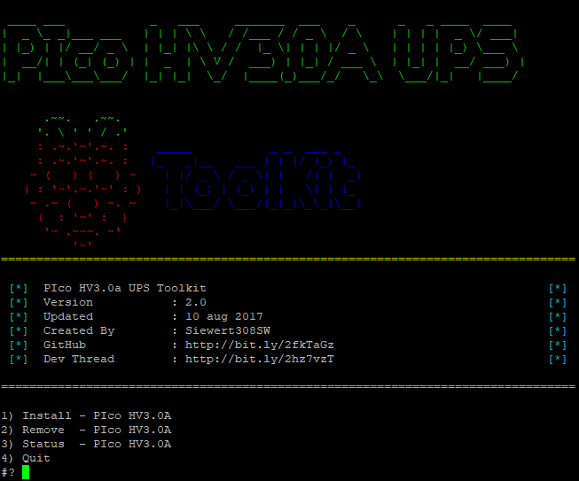

 

# PIco UPS HV3.0A Toolkit
Bash script that installs all necessities for PIco HV3.0A series 
If you want to comment or report bugs then please visit my thread on Pimodules. 
http://www.forum.pimodules.com/viewtopic.php?f=27&t=4870  
 
Here you'll find a install script as part of the original PIco UPS HV3.0A series manual, thx to @Pimaster for that. 
When using this script it aint mandatory to follow the install manual or install, amend anything to your Raspberry Pi3. 
This script is pretty straight forward. 
And takes care everything for you in order to be able to install all PIco UPS HV3.0A necessities. 
 

# Precautions
1. Install your PIco UPS board before continuing 
2. This script is only intended for Raspberry Pi 3 Model B Rev 1.2 
3. Its adviced to use a clean Rasbian Jessie, Stretch, Minibian, DietPi, Ubuntu Mate or LibreELE installation 
4. Latest 4.4.50 or 4.9 kernel 
5. Preflashed PIco firmware 0x30 or higher 
6. Correct timezone in raspi-config 
7. It's advised to make a backup of your sdcard first before continuing 
 

# Install guide via ssh
1. SSH into your Raspberry PI 
2. Create a bash file called picotoolkit.sh 
3. Copy and past the content from the (here) into your new create .sh file 
4. chmod +x /<file_location>/picotoolkit.sh 
5. sudo bash /<file_location>/picotoolkit.sh 
6. Follow instructions... 
 

# Install guide via ftp and ssh
1. Download a pre zipped .sh file from here 
2. Unzip this zipped file and copy the content to your Raspberry Pi with any kind of ftp program 
3. SSH into your Raspberry PI 
4. chmod +x /<file_location>/picotoolkit.sh 
5. sudo bash /<file_location>/picotoolkit.sh 
6. Follow instructions... 
 

# Disclaimer
I don't take any responsibility if your OS, Rpi or PIco board gets broken 
You are using this script on your own responsibility!!! 
